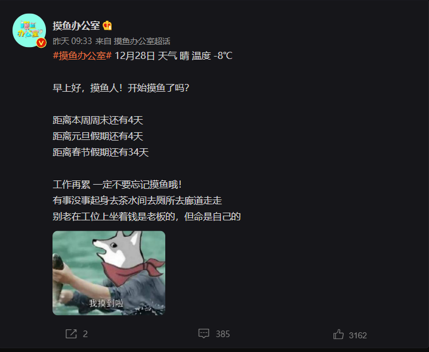

## 摸鱼倒计时
前段时间在微博看到一段摸鱼人的倒计时模板，
感觉还挺有趣的。

---




于是我用了一小时的时间写了个页面出来 [摸鱼办地址](https://tplan.cc) (当然是摸鱼的时间啦)。

模板是这样的:

<h1 align="center">摸鱼办公室 🐟</h1>

<center>
【摸鱼办公室】今天是 2021-11-30 星期二
<br>

你好，摸鱼人，工作再累，一定不要忘记摸鱼哦 !
有事没事起身去茶水间去廊道去天台走走，别老在工位上坐着。
多喝点水，钱是老板的，但命是自己的 ! 

🐟 距离 周末 放假还有 2 天

🐟 距离 元旦 放假还有 3 天

🐟 距离 过年 放假还有 34 天

🐟 距离 清明节 放假还有 97 天

🐟 距离 劳动节 放假还有 123 天

🐟 距离 端午节 放假还有 156 天

🐟 距离 中秋节 放假还有 255 天

🐟 距离 国庆节 放假还有 276 天
</center>

---

- 由于前端是单页面服务，直接撸一个原始的 `html` 网页就行。
- `FastAPI` 对于异步请求是一把好手、更轻、性能更佳。
- 挂上一层 `Nginx` 让它看起来想那么回事儿。


## 开撸

- 首先要知道、除了静态文字之外的比如当前日期、距离节日放假的天数等都是动态返回的，我需要使用 Jinja2 模板进行动态绑定。
- 我应该把重点放在时间的处理上。
- 而且在这个模板中，有阳历的节日，也是阴历的节日，我需要转换。

初始化一个 FastAPI 对象并声明静态页面的模板目录 (Jinja2Templates)
```python
# -*- coding: utf-8 -*-
import datetime
from fastapi import FastAPI, Request
from fastapi.responses import HTMLResponse
from fastapi.templating import Jinja2Templates
from zhdate import ZhDate as lunar_date

app = FastAPI(
    debug=False,
    title="My API",
    docs_url="/docs",
    openapi_url=f"/openapi.json"
)

templates = Jinja2Templates(directory="templates")
```

可以看到的是我用到了 `zhdate` 这个库、主要用于`阴历`和`阳历`之间的相互转换。用法如下

```python
today = datetime.date.today()
print(today.year, today.month, today.day)
print("大年时间: ", lunar_date(today.year+1, 1, 1).to_datetime().date())
print("端午时间: ", lunar_date(today.year, 5, 5).to_datetime().date())
print("中秋时间: ", lunar_date(today.year, 8, 15).to_datetime().date())
print("元旦时间: ", f"{today.year+1}-01-01")
print("清明时间: ", f"{today.year}-04-05")
print("劳动时间: ", f"{today.year}-05-01")
print("国庆时间: ", f"{today.year}-10-01")
```

我们可以梳理一下:

- 计算距离 `大年、元旦` 的天数时，要在年份上 `+1` 
- 计算距离 `其他节日` 的天数时，要判断天数差是否小于 `0`，如果是，则年份需要 `+1`，因为已经过去的节日对此没有意义

```python
distance_big_year = (lunar_date(today.year + 1, 1, 1).to_datetime().date() - today).days

distance_5_5 = (lunar_date(today.year, 5, 5).to_datetime().date() - today).days
distance_5_5 = distance_5_5 if distance_5_5 > 0 else (
        lunar_date(today.year + 1, 5, 5).to_datetime().date() - today).days

distance_8_15 = (lunar_date(today.year, 8, 15).to_datetime().date() - today).days
distance_8_15 = distance_8_15 if distance_8_15 > 0 else (
        lunar_date(today.year + 1, 8, 15).to_datetime().date() - today).days

distance_year = (datetime.datetime.strptime(f"{today.year + 1}-01-01", "%Y-%m-%d").date() - today).days

distance_4_5 = (datetime.datetime.strptime(f"{today.year}-04-05", "%Y-%m-%d").date() - today).days
distance_4_5 = distance_4_5 if distance_4_5 > 0 else (
        datetime.datetime.strptime(f"{today.year + 1}-04-05", "%Y-%m-%d").date() - today).days

distance_5_1 = (datetime.datetime.strptime(f"{today.year}-05-01", "%Y-%m-%d").date() - today).days
distance_5_1 = distance_5_1 if distance_5_1 > 0 else (
        datetime.datetime.strptime(f"{today.year + 1}-05-01", "%Y-%m-%d").date() - today).days

distance_10_1 = (datetime.datetime.strptime(f"{today.year}-10-01", "%Y-%m-%d").date() - today).days
distance_10_1 = distance_10_1 if distance_10_1 > 0 else (
        datetime.datetime.strptime(f"{today.year + 1}-10-01", "%Y-%m-%d").date() - today).days
```

怎么样? 我的命名足够疯狂吧。

接下来需要计算一下距离`周末`的天数。

```python
def get_week_day(date):
    week_day_dict = {
        0: '星期一',
        1: '星期二',
        2: '星期三',
        3: '星期四',
        4: '星期五',
        5: '星期六',
        6: '星期天',
    }
    day = date.weekday()
    return week_day_dict[day]

week_day_ = get_week_day(today)
print(f"今天是: {week_day_}") # 先获取今天是星期几
```

按照每周 `5` 个工作日计算，今天距离周末的天数就是
```python
5 - today.weekday() # today.weekday() 今天距离周末
```

现在将所有的数据组装起来
```python
time_ = [
    {"v_": distance_year, "title": "元旦"},  # 距离元旦
    {"v_": distance_big_year, "title": "过年"},  # 距离过年
    {"v_": distance_4_5, "title": "清明节"},  # 距离清明
    {"v_": distance_5_1, "title": "劳动节"},  # 距离劳动
    {"v_": distance_5_5, "title": "端午节"},  # 距离端午
    {"v_": distance_8_15, "title": "中秋节"},  # 距离中秋
    {"v_": distance_10_1, "title": "国庆节"},  # 距离国庆
]
```

至于为什么是 `List` 而不是 `Dict`，那是我需要做一个根据距离天数的`排序`，让最先放假的节日放于最前面，
这样看起来会舒服得多。

```python
time_ = sorted(time_, key=lambda x: x['v_'], reverse=False)
```

接下来要写一个 路由，将数据传入到 `html` 页面中去。

```python
@app.get("/", response_class=HTMLResponse)
async def readme(request: Request):
    return templates.TemplateResponse("readme.html",
                                      {"request": request, "time_": time_, "now_": now_, "week_day_": week_day_})
```

来看一下完整的代码 (main.py):
```python
# -*- coding: utf-8 -*-
import datetime
from fastapi import FastAPI, Request
from fastapi.responses import HTMLResponse
from fastapi.templating import Jinja2Templates
from zhdate import ZhDate as lunar_date

app = FastAPI(
    debug=False,
    title="My API",
    docs_url=f"/docs",
    openapi_url=f"/openapi.json"
)

templates = Jinja2Templates(directory="templates")

today = datetime.date.today()

# print(today.year, today.month, today.day)
# print("大年时间: ", lunar_date(today.year+1, 1, 1).to_datetime().date())
# print("端午时间: ", lunar_date(today.year, 5, 5).to_datetime().date())
# print("中秋时间: ", lunar_date(today.year, 8, 15).to_datetime().date())
# print("元旦时间: ", f"{today.year+1}-01-01")
# print("清明时间: ", f"{today.year+1}-04-05")
# print("劳动时间: ", f"{today.year+1}-05-01")
# print("国庆时间: ", f"{today.year+1}-10-01")

distance_big_year = (lunar_date(today.year + 1, 1, 1).to_datetime().date() - today).days

distance_5_5 = (lunar_date(today.year, 5, 5).to_datetime().date() - today).days
distance_5_5 = distance_5_5 if distance_5_5 > 0 else (
        lunar_date(today.year + 1, 5, 5).to_datetime().date() - today).days

distance_8_15 = (lunar_date(today.year, 8, 15).to_datetime().date() - today).days
distance_8_15 = distance_8_15 if distance_8_15 > 0 else (
        lunar_date(today.year + 1, 8, 15).to_datetime().date() - today).days

distance_year = (datetime.datetime.strptime(f"{today.year + 1}-01-01", "%Y-%m-%d").date() - today).days

distance_4_5 = (datetime.datetime.strptime(f"{today.year}-04-05", "%Y-%m-%d").date() - today).days
distance_4_5 = distance_4_5 if distance_4_5 > 0 else (
        datetime.datetime.strptime(f"{today.year + 1}-04-05", "%Y-%m-%d").date() - today).days

distance_5_1 = (datetime.datetime.strptime(f"{today.year}-05-01", "%Y-%m-%d").date() - today).days
distance_5_1 = distance_5_1 if distance_5_1 > 0 else (
        datetime.datetime.strptime(f"{today.year + 1}-05-01", "%Y-%m-%d").date() - today).days

distance_10_1 = (datetime.datetime.strptime(f"{today.year}-10-01", "%Y-%m-%d").date() - today).days
distance_10_1 = distance_10_1 if distance_10_1 > 0 else (
        datetime.datetime.strptime(f"{today.year + 1}-10-01", "%Y-%m-%d").date() - today).days


def get_week_day(date):
    week_day_dict = {
        0: '星期一',
        1: '星期二',
        2: '星期三',
        3: '星期四',
        4: '星期五',
        5: '星期六',
        6: '星期天',
    }
    day = date.weekday()
    return week_day_dict[day]


# print("距离大年: ", distance_big_year)
# print("距离端午: ", distance_5_5)
# print("距离中秋: ", distance_8_15)
# print("距离元旦: ", distance_year)
# print("距离清明: ", distance_4_5)
# print("距离劳动: ", distance_5_1)
# print("距离国庆: ", distance_10_1)
# print("距离周末: ", 5 - today.weekday())

now_ = f"{today.year}年{today.month}月{today.day}日"
week_day_ = get_week_day(today)
time_ = [
    {"v_": 5 - 1 - today.weekday(), "title": "周末"},  # 距离周末
    {"v_": distance_year, "title": "元旦"},  # 距离元旦
    {"v_": distance_big_year, "title": "过年"},  # 距离过年
    {"v_": distance_4_5, "title": "清明节"},  # 距离清明
    {"v_": distance_5_1, "title": "劳动节"},  # 距离劳动
    {"v_": distance_5_5, "title": "端午节"},  # 距离端午
    {"v_": distance_8_15, "title": "中秋节"},  # 距离中秋
    {"v_": distance_10_1, "title": "国庆节"},  # 距离国庆
]

time_ = sorted(time_, key=lambda x: x['v_'], reverse=False)


@app.get("/", response_class=HTMLResponse)
async def readme(request: Request):
    return templates.TemplateResponse("readme.html",
                                      {"request": request, "time_": time_, "now_": now_, "week_day_": week_day_})


if __name__ == '__main__':
    import uvicorn

    uvicorn.run(app='main:app', host="0.0.0.0", port=8080, reload=True)

```

最后就到了 `html` 页面部分了，来看一下主要的传值
```html
<center>
    【摸鱼办公室】今天是 {{ now_ }} {{ week_day_ }}
    <br><br>
    
        <p>🐟 距离 {{ v_.title }} 放假还有 {{ v_.v_ }} 天</p>
    
        <p>沒有任何值</p>
    

</center>
```

> 这样整个的路由构造和页面编写就算是完成了。


最后通过 `Nginx` 部署到我的站点上。

[摸鱼办预览地址](https://tplan.cc)

> 代码已经上传至 [摸鱼办](https://github.com/PY-GZKY/moyu)

> 你可能会有更多的想法、可以在评论区讨论、一切为了摸鱼。