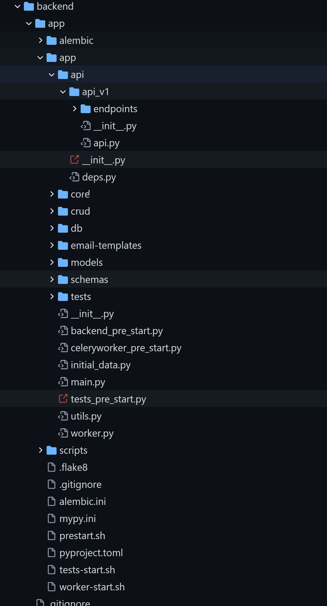
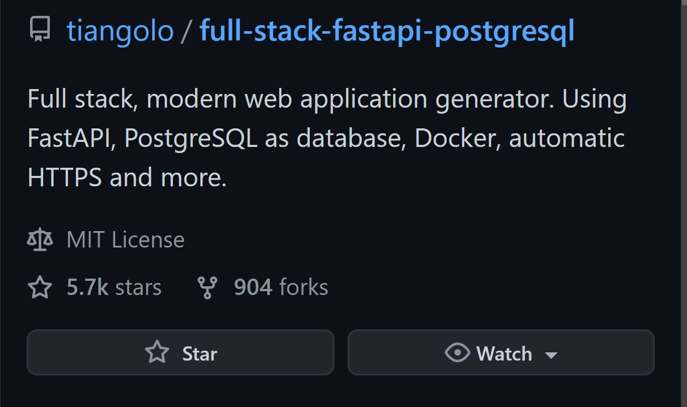

`fastapi` 的作者 `tiangolo` 提供了一个快速开发`脚手架模板` `full-stack-fastapi-postgresql`，
开发者可以根据实际需求`优化`或`重塑`这个模板。

> `full-stack-fastapi-postgresql`: [https://github.com/tiangolo/full-stack-fastapi-postgresql](https://github.com/tiangolo/full-stack-fastapi-postgresql)

> 这是一个`前后端`项目，但是对于大多数`后端开发`(包括我，虽然不是一个合格的后端) 只关注 `fastapi` 的 `backend` 部分。

其 `backend` 目录如下:

---

其中获 `Star` 数高达 `5.7k`，这说明良好的`脚手架`设计模式对于开发者有多么的重要。
 

