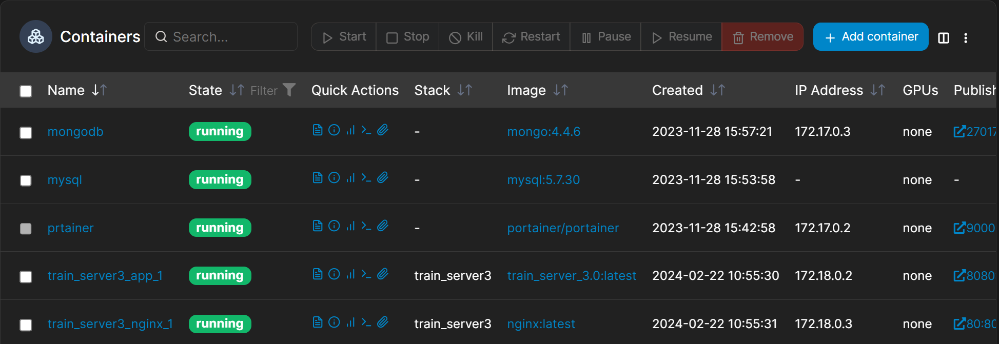

# 如何使用 Docker

## 什么是 Docker 应用?

使用Docker部署应用是当今开发和运维领域的一种流行做法，它不仅提高了开发和部署的效率，还通过容器化技术保证了应用的可移植性和安全性。
以下是一个更详细的指南，帮助你使用Docker进行应用部署。

## Docker 有什么优势?

- **灵活性**：Docker可以将应用及其依赖打包成一个镜像，无论应用环境多么复杂，都可以轻松管理和迁移。
- **便携性**：镜像一旦被打包，可以在任何支持Docker的环境中运行，确保了一致的运行效果。
- **高效性**：容器直接运行在宿主机的操作系统内核上，不需要额外的虚拟化开销，提高了资源利用率。
- **安全性**：容器之间相互隔离，即使一个容器崩溃，也不会影响到其他容器。

## 如何构建 Docker 镜像?

### 1. 构建Docker镜像

首先，需要有一个`Dockerfile`，它是一个文本文件，包含了构建Docker镜像所需的指令和步骤。

```shell
docker build -t app_name -f Dockerfile .
```

这条命令会根据当前目录下的`Dockerfile`文件内容，构建一个名为`app_name`的Docker镜像。

### 2. 保存镜像为文件（可选）

构建完成后，可以将Docker镜像保存为文件，方便迁移和备份。

```shell
docker save app_name:latest | gzip > app_name.tar.gz
```
这条命令会将`app_name`镜像保存为一个名为`app_name.tar.gz`的压缩文件。

## 如何启动 Docker 容器?

### Redis部署

```shell
docker run -d --name redis \
--restart=always \
-v /path/to/redis/conf/redis.conf:/etc/redis.conf \
-v /path/to/redis/data:/data \
-p 6379:6379 \
redis:5.0.3 redis-server /etc/redis.conf
```

### MySQL部署

```shell
docker run -d --name mysql \
--restart=always \
-e MYSQL_ROOT_PASSWORD=123456 \
-e MYSQL_TZ='+8:00' \
-v /home/server/mysql/datadb:/var/lib/mysql \
-v /home/server/mysql/mysql.conf.d:/etc/mysql/mysql.conf.d \
-p 3306:3306 mysql:5.7.30
```

### MongoDB部署

```shell
docker run -d --name mongodb \
--restart=always \
-e MONGO_INITDB_ROOT_USERNAME=admin \
-e MONGO_INITDB_ROOT_PASSWORD=123456 \
-v /home/server/mongo/datadb:/data/db \
-p 27017:27017 mongo:4.4.6
```

这条命令会以守护进程方式运行Redis容器，使用自定义的配置文件和数据目录，并将容器的6379端口映射到宿主机的6379端口。

## 如何删除或清理 Docker 容器?

```shell
docker ps -a | grep Exited | awk '{print $1}' | xargs docker rm
```
这条命令会查找所有状态为Exited的容器，并将它们删除。

```shell
docker images -q --filter "dangling=true" | xargs docker rmi
```
这条命令会删除所有未被标记或未被容器使用的镜像，释放空间。

Docker的维护命令可以帮助你保持环境的清洁和高效。记得在实际部署前，根据自己的需要调整命令中的参数，如镜像名、容器名、端口映射等。


## 安装 Docker Compose

建议安装 docker 自带的 Compose 工具，它比基于 Python（pip）安装的 docker-compose 功能更全，版本更新更及时。

安装最新版本：
```
sudo curl -L "https://github.com/docker/compose/releases/download/latest/docker-compose-$(uname -s)-$(uname -m)" -o /usr/local/bin/docker-compose
```

使用下列命令赋予二进制文件可执行权限：
```
sudo chmod +x /usr/local/bin/docker-compose
```

运行下列命令检查安装的 Docker Compose 版本：
```
sudo docker-compose version
```

注意：最新版本的 Docker Compose 已经不再需要在 yaml 文件中指定版本号，可移除。

## 如何搭建 Docker 可视化管理?

Portainer 是一款开源的轻量级管理工具，旨在帮助用户通过Web用户界面轻松管理Docker或Kubernetes环境。它的直观界面使得即使是Docker和Kubernetes的新手也能快速上手，同时也为高级用户提供了强大的功能。下面是如何安装和使用Portainer进行Docker环境管理的详细指南。

### Portainer 的特点

- **直观的Web界面**：提供用户友好的界面，简化容器、镜像、网络和卷的管理。
- **全面的管理功能**：支持容器的生命周期管理，包括创建、启动、停止、删除等操作，以及镜像、网络和卷的管理。
- **实时监控**：查看容器日志、资源使用情况、环境变量等信息，帮助用户监控和调试应用。
- **多用户支持**：支持多用户登录和权限管理，适合团队协作。
- **跨平台支持**：不仅可以管理Docker，还可以管理Kubernetes集群。

### 安装 Portainer

Portainer 可以作为一个容器运行在任何安装了Docker的机器上。下面是安装Portainer的步骤：

1. **运行 Portainer 容器**

   使用以下命令来启动Portainer容器：
   ```shell
    docker run -d -p 9000:9000 --restart=always -v /var/run/docker.sock:/var/run/docker.sock --name portainer portainer/portainer
   ```

2. **访问 Portainer**

   安装完成后，通过浏览器访问 `http://<你的机器IP或域名>:9000`
   来打开Portainer的Web界面。首次访问时，系统会提示你创建一个管理员账户。完成注册后，登录到Portainer的仪表板。

### 使用 Portainer

在Portainer的Web界面中，你可以进行以下操作：

- **容器管理**：在“容器”菜单下，你可以查看所有运行中和已停止的容器，创建新容器，以及启动、停止、删除或进入容器的控制台。
- **镜像管理**：在“镜像”菜单下，你可以查看本地存储的镜像，拉取新镜像，或删除无用镜像。
- **网络管理**：在“网络”菜单下，你可以查看和管理Docker网络，创建新网络或删除不再需要的网络。
- **数据卷管理**：在“卷”菜单下，你可以管理Docker的数据卷，这对于持久化容器数据非常重要。
- **查看日志和监控**：Portainer允许你查看容器的实时日志和历史日志，以及容器的资源使用情况，帮助你监控和调试应用。

Portainer还提供了更高级的功能，如堆栈、服务、秘密和配置管理，特别是在Docker
Swarm或Kubernetes环境中。通过这些功能，Portainer成为了一个非常强大的容器管理工具，无论是对于个人开发者还是团队来说都是一个很好的选择。



## Harbor 访问控制

什么是 Harbor？

Harbor 是一个先进的企业级容器镜像仓库（Registry），它为存储、签名和扫描容器镜像提供了丰富的功能，确保容器化应用的安全性和一致性。作为一个由中国网易公司捐赠给Cloud
Native Computing Foundation（CNCF）并已毕业的项目，Harbor 在全球范围内被广泛认可和使用，特别是在需要严格遵守数据治理和安全性要求的企业环境中。

### Harbor 的核心特性

1. **基于角色的访问控制（RBAC）**：Harbor 允许管理员根据用户的角色分配不同的权限，从而细粒度地控制对镜像仓库的访问。这种方式确保只有授权的用户才能推送、拉取或管理镜像。

2. **漏洞扫描**：Harbor 集成了漏洞扫描工具，如Clair和Trivy，能够自动扫描仓库中的镜像以识别已知的安全漏洞。这有助于保证部署到生产环境中的镜像是安全的。

3. **内容信任**：通过与Notary的集成，Harbor 支持Docker Content Trust，允许用户签名镜像并验证镜像的完整性和来源，确保部署的镜像未被篡改。

4. **复制策略**：Harbor 支持跨多个注册表的镜像复制，这意味着企业可以轻松地在多个环境或地理位置之间同步镜像，支持灾难恢复和数据本地化需求。

5. **高可用性和多租户**：Harbor 设计考虑到了企业级的高可用性和多租户需求，支持横向扩展以适应高负载，同时通过项目来实现资源隔离，满足多团队或多项目的管理需求。

### 为什么选择 Harbor 而不是 DockerHub?

尽管 DockerHub 是最流行的公共容器镜像仓库，提供了大量的社区镜像资源，但对于企业用户来说，选择 Harbor 作为私有或内部镜像仓库有以下几个理由：

- **访问速度**：对于在中国或其他网络连接到DockerHub较慢的地区的用户，使用Harbor部署在本地或者更靠近用户的数据中心可以显著提高镜像拉取的速度。

- **安全和合规性**：Harbor 提供了细粒度的访问控制和安全扫描功能，帮助企业满足严格的安全和合规性要求。同时，通过内容信任和镜像签名，确保镜像的安全性和完整性。

- **自主控制**：与将镜像存储在公共云服务如DockerHub相比，部署Harbor使企业能够完全控制其镜像仓库，包括数据的存储位置、访问策略和管理过程。

- **成本控制**：对于需要大量存储和带宽的企业，使用Harbor可以更有效地控制成本，特别是可以通过内部网络来分发镜像，避免了使用外部服务可能产生的额外费用。

Harbor 通过其企业级特性，如基于角色的访问控制、漏洞扫描、内容信任、复制策略以及对高可用性和多租户的支持，提供了一个安全、可靠和高效的容器镜像管理平台。对于追求高性能、安全合规以及自主控制的组织来说，Harbor
是一个理想的选择。
